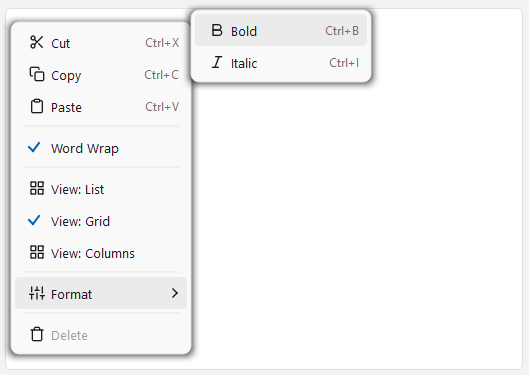
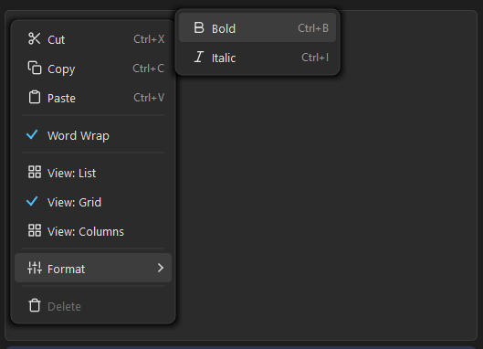
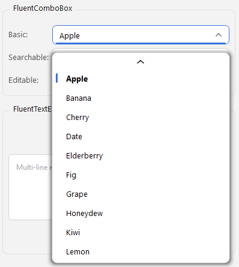
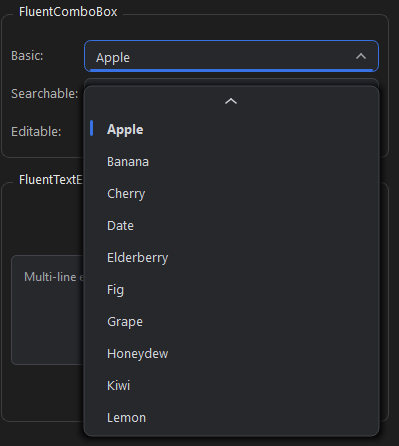
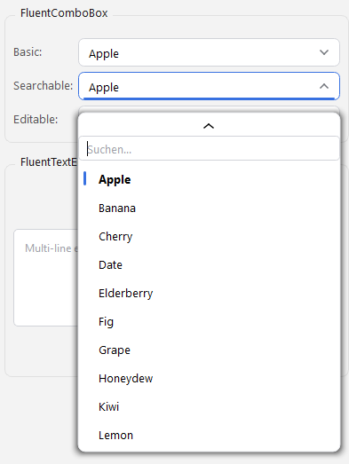
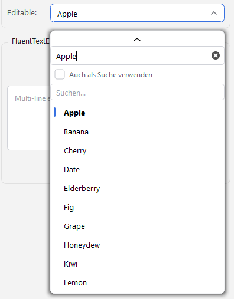
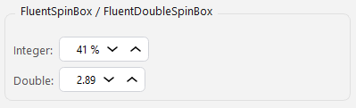

# Fluent Inputs for PySide6

**Disclaimer:** This project is provided as-is, without warranty of any kind. Use it at your own risk. There is no guarantee of continued maintenance, updates, or bug fixes. The author assumes no liability for any issues arising from the use of this code in your projects.

Windows 11 Fluent Design **input controls** for PySide6 — a line edit, a multi-line text edit, integer/double spin boxes, and a fully custom combobox. All custom-painted with `QPainter`, no native chrome, no QSS hacks.


<!--  -->

## Widgets

| File | Class | What it is |
|---|---|---|
| `fluent_line_edit.py` | `FluentLineEdit` | `QLineEdit` with edit/display modes + affix warnings |
| `fluent_text_edit.py` | `FluentTextEdit` | `QTextEdit` with edit/display modes |
| `fluent_spin_box.py` | `FluentSpinBox`, `FluentDoubleSpinBox` | Spin boxes with chevron steppers |
| `fluent_combo_box.py` | `FluentComboBox` | Custom combobox — searchable, editable, ghost autocomplete |
| `fluent_context_menu.py` | `FluentContextMenu` | Bundled dependency — powers the Fluent right-click menu |

Every widget takes a `dark_mode` flag (and exposes it as a property). The line edit, text edit, and combo box show a **bundled Fluent context menu** on right-click — that's why `fluent_context_menu.py` ships alongside them. Beyond that file, zero dependencies other than PySide6.

> **Note:** These are the standalone versions. The originals in my app also support inline spellchecking (via a private dictionary service); that feature has been removed here so the widgets stay dependency-free.

## Preview
### Context Menu


### Combo Box






### Spin Box



## Install

Copy the files you want into your project (keep `fluent_context_menu.py` next to the text widgets):

```bash
git clone https://github.com/MaxGroiss/fluent-inputs-pyside6.git
```

**Requires:** PySide6 ≥ 6.7 (tested with 6.10.2), Python ≥ 3.10

## Run the demo

```bash
pip install PySide6
python demo.py
```

Toggle **Dark Mode** to switch every control for screenshots. Right-click any text field for the Fluent context menu.

---

## FluentLineEdit

A `QLineEdit` that draws its own Fluent border (hover + focus accent) and can switch to a transparent, read-only **display mode** that looks like a plain label.

```python
from fluent_line_edit import FluentLineEdit

edit = FluentLineEdit(dark_mode=True)
edit.setText("Editable")

# Label-like, read-only view state (not greyed out)
edit.display_mode = True

# Warn (red border + accent) when text starts/ends with a forbidden char
edit.set_invalid_prefixes(["_", "-"])
print(edit.has_affix_warning)
```

It's a real `QLineEdit` subclass, so the full `QLineEdit` API still applies.

## FluentTextEdit

A `QTextEdit` with the same edit/display-mode toggle, plus an `editing_finished` signal on focus-out.

```python
from fluent_text_edit import FluentTextEdit

te = FluentTextEdit(dark_mode=True)
te.setPlaceholderText("Write something...")
te.editing_finished.connect(lambda: print("done:", te.toPlainText()))
te.display_mode = True   # transparent, read-only
```

## FluentSpinBox / FluentDoubleSpinBox

`QSpinBox` / `QDoubleSpinBox`-compatible spin boxes with chevron buttons, press-and-hold auto-repeat, mouse-wheel and arrow-key stepping, prefix/suffix, special value text, and wrapping.

```python
from fluent_spin_box import FluentSpinBox, FluentDoubleSpinBox

spin = FluentSpinBox(dark_mode=True)
spin.setRange(0, 100)
spin.setValue(42)
spin.setSuffix(" %")
spin.valueChanged.connect(print)

dspin = FluentDoubleSpinBox(dark_mode=True)
dspin.setRange(0.0, 1.0)
dspin.setSingleStep(0.05)
dspin.setDecimals(2)
```

## FluentComboBox

A fully custom combobox — **no `QComboBox`**. Frameless translucent dropdown with rounded corners, per-item hover, and reliable open/close behaviour. Several modes:

```python
from fluent_combo_box import FluentComboBox

# Basic
combo = FluentComboBox(dark_mode=True)
combo.add_items(["Apple", "Banana", "Cherry"])
combo.add_item("Date", icon=my_icon, data={"id": 4})
combo.currentIndexChanged.connect(print)

# Searchable — type-to-filter field at the top of the dropdown
search = FluentComboBox(searchable=True)

# Editable — type a value, with ghost autocomplete (Tab to accept) and an
# optional "use as search" checkbox; freetext is allowed
editable = FluentComboBox(editable=True, placeholder="Type or pick...")

# Read-only display mode (shows the value, no dropdown, not greyed out)
combo.display_mode = True
```

Highlights: `searchable`, `editable` (ghost autocomplete + freetext), `search_mode` (inline search field as the widget itself), separators, per-item icons/data, invalid prefix/suffix validation, flip-up/flip-down for long lists, and full keyboard navigation.

**Key API:** `add_item()`, `add_items()`, `add_separator()`, `insert_item()`, `remove_item()`, `clear()`, `load_items()`, `set_current_index()`, `set_current_text()`, `find_text()`, `find_data()`; properties `current_index`, `current_text`, `current_data`, `count`, `display_mode`, `dark_mode`.
**Signals:** `currentIndexChanged(int)`, `currentTextChanged(str)`, `editTextChanged(str)`.

---

## License

MIT — do whatever you want. See [LICENSE](LICENSE).
